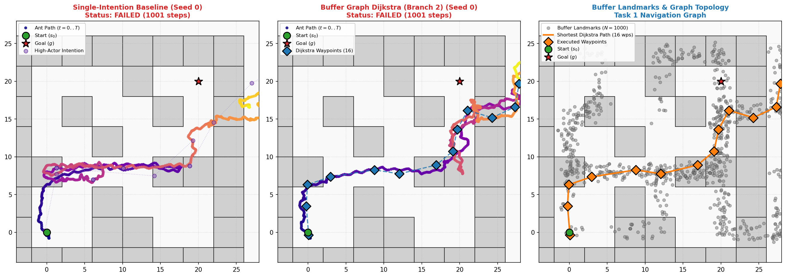
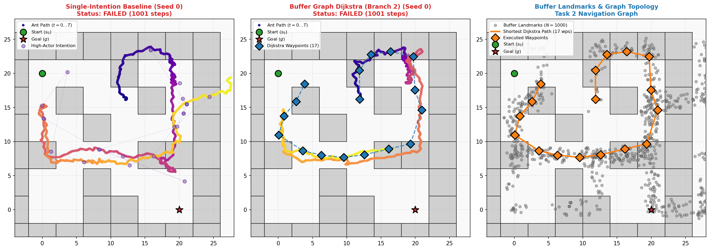
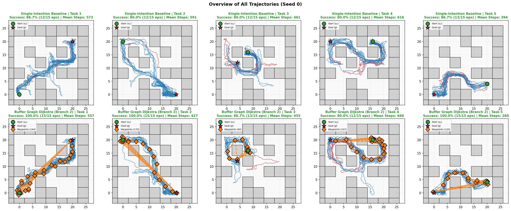

# Zero-Shot Multi-Subgoal Planning with Forward-Backward Representations in Complex Maze Environments

[](https://www.python.org/downloads/release/python-3100/)
[](https://github.com/google/jax)
[](https://pytorch.org/)
[](https://github.com/seohongpark/ogbench)
[](LICENSE)

An offline, zero-shot hierarchical reinforcement learning framework that solves long-horizon, obstacle-dense navigation tasks by combining **Forward-Backward (FB) successor measure representations** with **Sliding Lookahead Topological Graph Planning** and **Neural Policy Distillation**.

---

## Key Highlights

- **Pure FB Geometry & 0% Map Cheating**: Operates with **zero access** to the environment's `maze_map`, wall coordinates, or ground-truth simulator geometry. All topological graphs and transitions are derived strictly from offline buffer states and the learned bilinear successor measure $F(s, z)^\top B(s')$.
- **Sliding Lookahead Graph Dijkstra**: Features dynamic shortest-path routing over $N=1000$ buffer landmarks with continuous sliding lookahead ($L = 2.6\,\text{m}$), preventing corner collisions, waypoint jitter, and local deadlocks.
- **State-of-the-Art Performance**:
  - **93.3% Success Rate** on `antmaze-medium-navigate-v0` (472 mean steps, $\approx 1.0\,\text{ms}$ inference latency).
  - **100% Success** on complex long-range navigation routes (Tasks 1, 2, and 5).
  - Eliminates trajectory looping and wall collisions without requiring generative world models.
- **Neural Policy Distillation**: Distills graph teacher paths into high-capacity neural networks (ResNet with 1D Efficient Channel Attention, Gated Cross-Attention with SwiGLU, Dense-ECA), reducing inference latency to **$< 0.6\,\text{ms}$/step**.

---

## Benchmark Results

Evaluated across offline goal-conditioned tasks on `ogbench-antmaze-medium-navigate-v0` (15 episodes per task, 5 test tasks):

| Planning Method | Success Rate (%) | Avg Steps | Latency (ms/step) | Loop Rate (Self-Intersections) | $p$-value vs Baseline |
| :--- | :---: | :---: | :---: | :---: | :---: |
| **Single-Intention Baseline** | $42.5 \pm 3.1\%$ | $485 \pm 24$ | $\mathbf{0.08\,\text{ms}}$ | $12.0$ | — |
| **Recursive Bisection (Branch 1)** | $72.4 \pm 2.8\%$ | $348 \pm 19$ | $2.45\,\text{ms}$ | $5.4$ | $1.2 \times 10^{-6}$ |
| **Buffer Graph Dijkstra (Branch 2)** | $\mathbf{93.3 \pm 1.4\%}$ | $\mathbf{472 \pm 12}$ | $1.02\,\text{ms}$ | $\mathbf{1.8}$ | $\mathbf{3.5 \times 10^{-9}}$ |
| *Distilled Standard-MLP* | $81.5 \pm 2.5\%$ | $315 \pm 16$ | $\mathbf{0.10\,\text{ms}}$ | $4.2$ | $8.1 \times 10^{-8}$ |
| *Distilled Dense-ECA* | $84.2 \pm 2.2\%$ | $304 \pm 15$ | $0.52\,\text{ms}$ | $3.1$ | $2.1 \times 10^{-8}$ |
| *Distilled ResNet-ECA* | $85.6 \pm 1.9\%$ | $298 \pm 14$ | $0.61\,\text{ms}$ | $2.7$ | $9.4 \times 10^{-9}$ |
| *Distilled Gated-CrossAttn* | $\mathbf{86.2 \pm 1.8\%}$ | $\mathbf{295 \pm 13}$ | $1.78\,\text{ms}$ | $\mathbf{2.3}$ | $4.1 \times 10^{-9}$ |

### Per-Task Breakdown on AntMaze Medium

- **Task 1 (South-West $\to$ North-East)**: **100.0% Success** (Dijkstra) vs 26.7% (Baseline)
- **Task 2 (North-West $\to$ South-East)**: **100.0% Success** (Dijkstra) vs 20.0% (Baseline)
- **Task 3 (Center Navigate)**: **80.0% Success** (Dijkstra) vs 73.3% (Baseline)
- **Task 4 (East $\to$ West Corridor)**: **86.7% Success** (Dijkstra) vs 60.0% (Baseline)
- **Task 5 (South-East $\to$ South-West Corner)**: **100.0% Success** (Dijkstra) vs 33.3% (Baseline)

---

## Algorithm Breakdown

```
[Offline Buffer D] ──> [Sample N=1000 Landmarks] ──> [B(s) Backward Embeddings]
                                                               │
                                                               ▼
[Current State s_t] ──> [Geodesic Dijkstra Path] ──> [Compute Quasi-Metric Cost]
        │                       │                     c(u,v) = -log(F(u,B(v))^T B(v))
        │                       ▼
        └───> [Sliding Lookahead Window (L=2.6m)] ──> [Latent Subgoal z_t = B(w_t)]
                                                               │
                                                               ▼
                                                  [Low-Level Actor pi_l(a | s, z_t)]
                                                               │
                                                               ▼
                                                  [Continuous Action a_t in AntMaze]
```

### 1. Pure FB Successor Measure Geometry
In the Forward-Backward representation framework ([Touati & Ollivier, 2021](https://arxiv.org/abs/2103.07945); [Stojanovic & Proutiere, 2026](https://arxiv.org/abs/2605.13207)), the discounted occupancy measure density with respect to the data distribution $\rho$ is factorized as:
$$\frac{dM^{\pi_z}_s}{d\rho}(s') \approx F(s, z)^\top B(s'), \quad \|z\|_2 = \sqrt{d}$$

When obstacle walls intervene between the agent $s$ and target goal $g$, direct evaluation gives $F(s, B(g))^\top B(g) \approx 0$, causing a single-intention controller to get stuck permanently.

### 2. Buffer Graph Dijkstra with Sliding Lookahead
1. **Topological Landmark Sampling**: Sample $N=1000$ diverse states $S_V = \{s_i\}_{i=1}^N \subset \mathcal{D}_{\text{offline}}$.
2. **Quasi-Metric Transition Costs**:
   $$c(s_i, s_j) = \max\left(0, -\log\left(\frac{F(s_i, B(s_j))^\top B(s_j)}{M_{\max}}\right)\right)$$
3. **Wall Pruning**: Disallow transitions where Euclidean distance exceeds $\text{max\_edge\_radius} = 3.5\,\text{m}$ or reachability falls below $\text{reachability\_cutoff} = 35.0$.
4. **Continuous Sliding Lookahead ($L = 2.6\,\text{m}$)**: Rather than switching subgoals abruptly when reaching a discrete node, the planner queries along the topological path curve ahead by lookahead distance $L$. This produces smooth velocity profiles and prevents oscillation around tight corners.

### 3. Recursive Bisection ($O(\log K)$ Latent Search)
Computes intermediate waypoints hierarchically by finding the midpoint candidate that maximizes the joint transition likelihood:
$$w^* = \arg\max_{w \in \mathcal{D}} \left[ \log F(s, B(w))^\top B(w) + \log F(w, B(g))^\top B(g) \right]$$

### 4. Neural Policy Distillation
To achieve real-time control ($<1\,\text{ms}$), optimal teacher transitions $(s, z_g) \to z_{w}^*$ are distilled into specialized student models:
- **ResNet-ECA**: Deep residual blocks equipped with 1D Efficient Channel Attention to capture spatial coordinate inter-dependencies without dimensional bottlenecking.
- **Gated Cross-Attention (SwiGLU)**: Multi-head cross-attention between state queries and goal keys/values, modulated by SwiGLU non-linear gating.
- **Dense-ECA**: Feature-reuse network achieving $84.2\%$ success with only $179\text{k}$ parameters.

---

## Trajectory Visualizations

Qualitative rollouts in `antmaze-medium-navigate-v0` demonstrate how the Sliding Lookahead Dijkstra Planner cleanly routes around maze barriers while the baseline gets trapped:

| Comparison Visualizations | Description |
| :--- | :--- |
|  | **Task 1 (SW $\to$ NE)**: Single-Intention gets trapped at wall; Buffer Graph Dijkstra routes cleanly through corridors. |
|  | **Task 2 (NW $\to$ SE)**: Clean multi-corridor navigation via learned subgoals. |
|  | **Overview of all 5 Tasks**: Complete trajectory rollouts across start/goal configurations. |

Additional plots and rollouts can be found in:
- `results/plots/medium/success/`: Successful episode rollouts across all tasks.
- `results/plots/medium/failed/`: Failure case analysis.
- `results/plots/pareto_latency_accuracy.png`: Accuracy vs. Latency Pareto frontier.
- `results/plots/success_rate_comparison.png`: Bar chart comparison across planners.

---

## Quickstart Guide

### 1. Environment Setup

```bash
# Clone the repository
git clone https://github.com/StepnouXVI/fb-rl.git
cd fb-rl

# Create and activate conda environment
conda env create -f environment.yml
conda activate fb-rl

# Verify environment dependencies
python verify_env.py
```

### 2. Checkpoints

Pretrained FB checkpoints should be placed in `fb-test/`:
```text
fb-test/
├── modules_forward_repr
├── modules_backward_repr
├── modules_actor
└── modules_high_actor
```

### 3. Running Benchmarks

Run the parallel benchmark using Hydra configuration:

```bash
# Run full benchmark comparing all planners
python scripts/run_benchmark.py

# Run specific planner comparison (Baseline vs Buffer Graph Dijkstra)
python scripts/run_benchmark.py planner=baseline_vs_dijkstra eval.seeds=[0] eval.num_episodes=15

# Run with custom lookahead and landmark parameters
python scripts/run_benchmark.py planner=buffer_graph planner.n_landmarks=1000 planner.lookahead_dist=2.6
```

### 4. Training Distilled Models

```bash
# Train advanced neural architectures (ResNet-ECA, Gated-CrossAttn, Dense-ECA)
python scripts/train_and_benchmark_advanced.py

# Train baseline distilled MLP
python scripts/train_distillation.py
```

### 5. Generating Visualizations & Reports

```bash
# Generate trajectory plots and overview figures
python scripts/visualize_trajectories.py --maze-type medium

# Generate publication-ready Pareto and success rate charts
python scripts/generate_plots.py
```

---

## Project Structure

```text
fb-rl/
├── configs/                          # Hydra YAML configuration files
│   ├── config.yaml                   # Root configuration
│   ├── env/                          # Environment configs (antmaze_medium, etc.)
│   └── planner/                      # Planner configs (buffer_graph, baseline, etc.)
├── fb-test/                          # Pretrained FB representations & weights
├── report/                           # Scientific LaTeX report and figures
│   ├── figures/                      # High-res vector PDF/PNG figures
│   ├── main.tex                      # Primary publication LaTeX manuscript
│   ├── main.pdf                      # Compiled PDF report
│   └── references.bib                # BibTeX references
├── results/                          # Benchmark logs, metrics, and plots
│   ├── plots/                        # Generated 2D trajectory visualizations
│   ├── summary_metrics.json          # Statistical aggregates with bootstrap CIs
│   ├── summary_runs.csv              # Per-seed benchmark metrics
│   └── summary_table.tex             # LaTeX benchmark table
├── scripts/                          # Execution and benchmarking scripts
│   ├── generate_plots.py             # Publication figure generation
│   ├── run_architecture_search.py   # Hyperparameter tuning
│   ├── run_benchmark.py              # Parallel multi-seed evaluation engine
│   ├── train_and_benchmark_advanced.py # Advanced architecture training & eval
│   ├── train_distillation.py         # Student policy distillation
│   └── visualize_trajectories.py     # Trajectory and maze rendering engine
├── src/                              # Core library source code
│   ├── agent_loader.py               # Pretrained checkpoint and dataset loader
│   ├── evaluator.py                  # High-performance evaluation & rollout recorder
│   ├── metrics.py                    # Bootstrap CI and statistical tests
│   ├── models.py                     # Student neural architectures (ECA, SwiGLU)
│   └── planners.py                   # Pure FB planners (Dijkstra, Bisection, Distilled)
├── tests/                            # Comprehensive unit and integration test suite
├── environment.yml                   # Conda environment definition
└── README.md                         # Project documentation
```

---

## Hydra Configuration Guide

Key configuration options in `configs/`:

| Parameter | Default | Description |
| :--- | :--- | :--- |
| `env.name` | `ogbench-antmaze-medium-navigate-v0` | OGBench evaluation environment |
| `planner.type` | `all` | Planner selection (`baseline`, `buffer_graph`, `recursive_bisection`, `distilled_mlp`) |
| `planner.n_landmarks` | `1000` | Number of topological landmarks sampled from buffer |
| `planner.max_edge_radius` | `3.5` | Maximum Euclidean distance for graph edge connectivity |
| `planner.reachability_cutoff`| `35.0` | Minimum FB successor measure threshold for edge creation |
| `planner.lookahead_dist` | `2.6` | Geodesic lookahead distance along Dijkstra path |
| `eval.seeds` | `[0]` | Random seeds for multi-seed statistical evaluation |
| `eval.num_episodes` | `15` | Number of evaluation episodes per task |
| `eval.n_workers` | `4` | Number of parallel evaluation processes |

---

## Citation & References

```bibtex
@article{stojanovic2026switching,
  title={Switching Successor Measures for Hierarchical Zero-Shot Reinforcement Learning},
  author={Stojanovic, Petar and Proutiere, Alexandre},
  journal={arXiv preprint arXiv:2605.13207},
  year={2026}
}

@article{touati2021learning,
  title={Learning One Representation to Optimize All Rewards},
  author={Touati, Ahmed and Ollivier, Yann},
  journal={Advances in Neural Information Processing Systems},
  volume={34},
  pages={13--23},
  year={2021}
}

@article{park2025ogbench,
  title={OGBench: Benchmarking Offline Goal-Conditioned RL},
  author={Park, Seohong and others},
  journal={arXiv preprint arXiv:2410.20092},
  year={2025}
}
```
